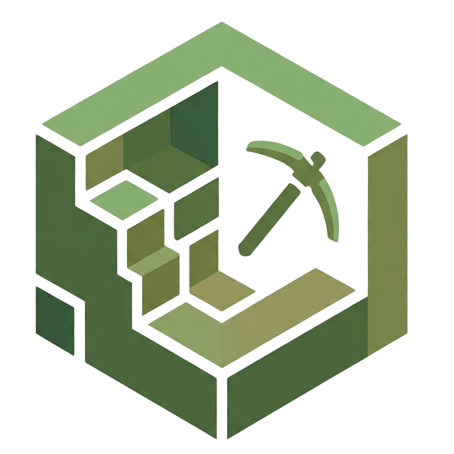
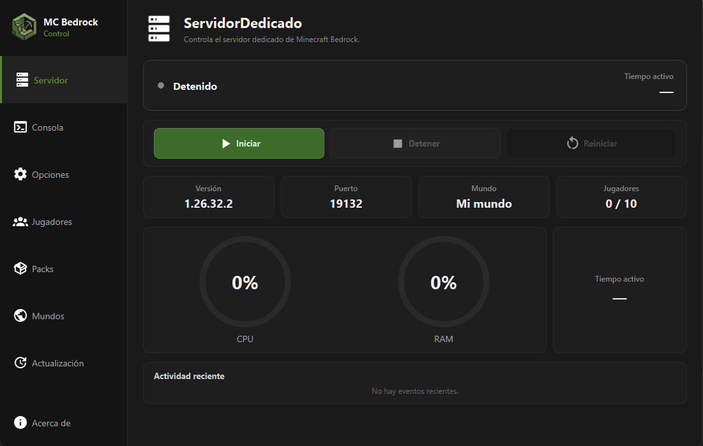
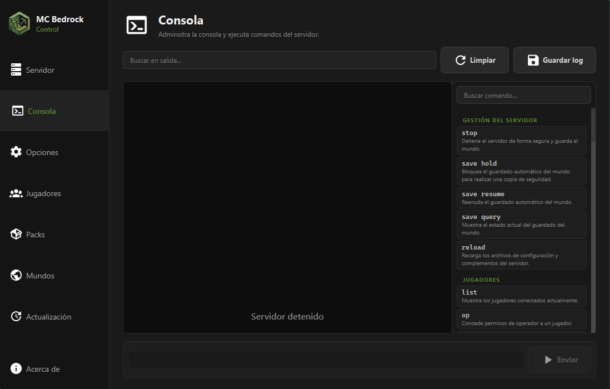
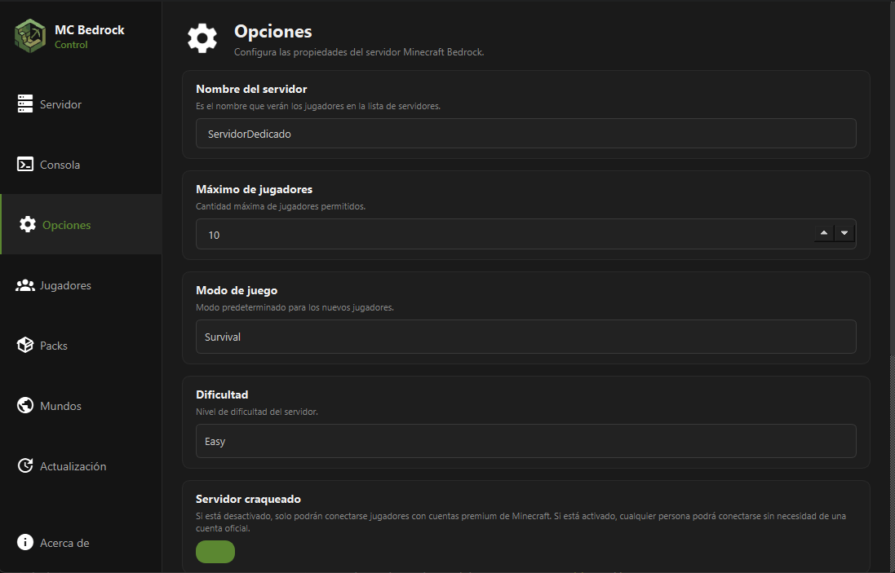
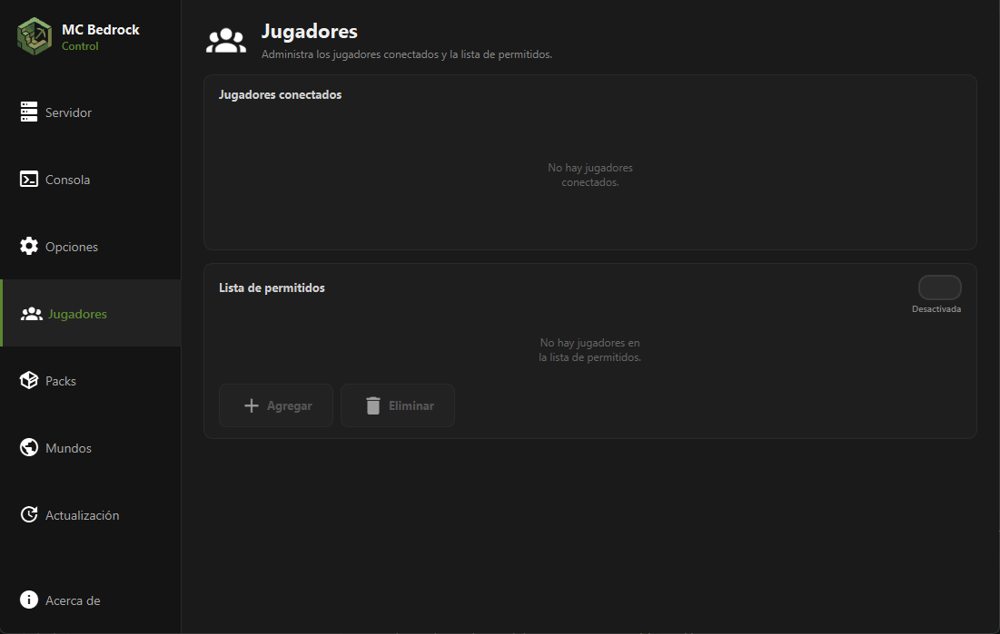
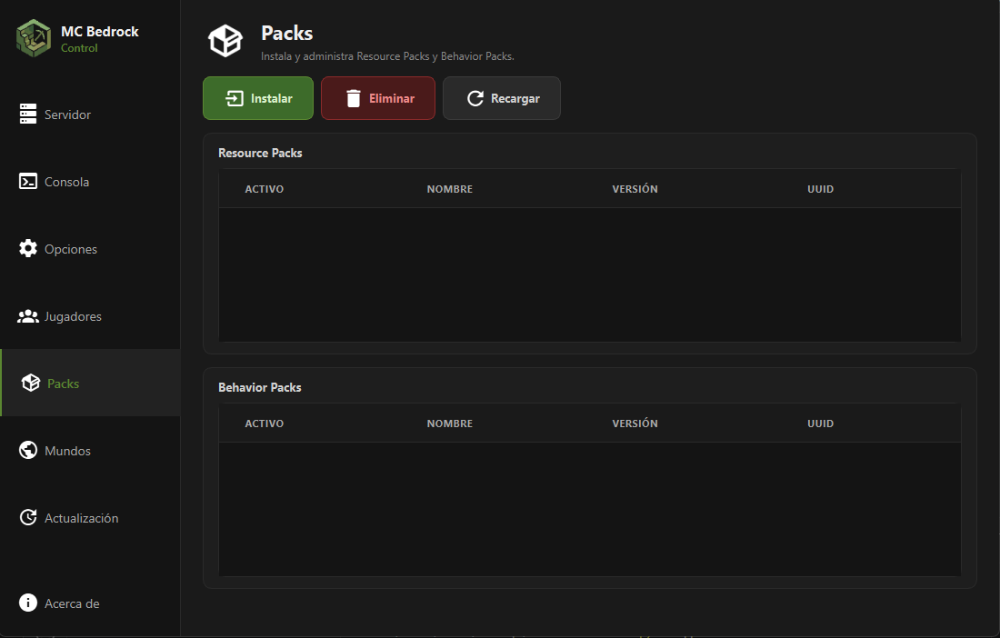
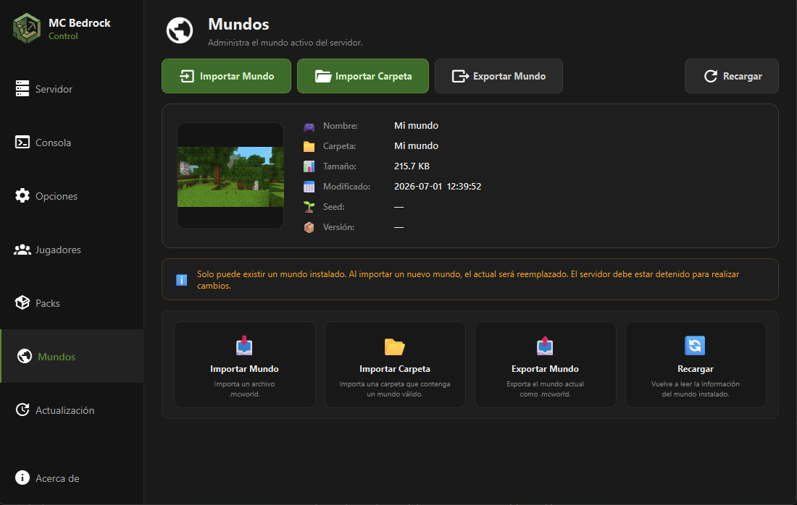
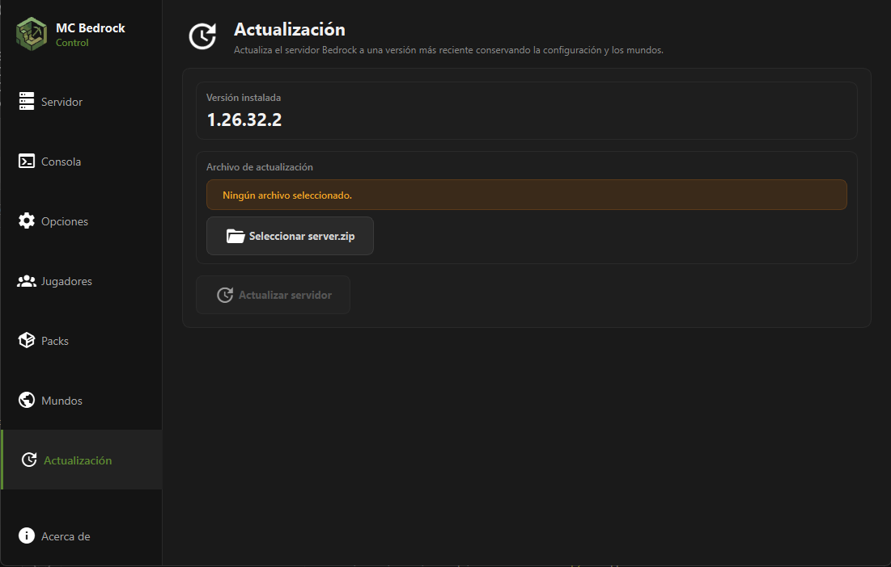

# 🎮 MC Bedrock Control

<div align="center">




### Administrador gráfico para servidores dedicados de Minecraft Bedrock Edition.


</div>

---

## 📖 Descripción

MC Bedrock Control es una aplicación de escritorio desarrollada en Python que facilita la administración de servidores dedicados de Minecraft Bedrock Edition mediante una interfaz gráfica moderna.

El objetivo del proyecto es ofrecer una alternativa sencilla para usuarios que no desean administrar el servidor únicamente mediante archivos de configuración o la consola.

---

> **⚠️ Aviso**
>
> MC Bedrock Control es un proyecto independiente y no está afiliado, respaldado ni desarrollado por Mojang Studios o Microsoft. Minecraft es una marca registrada de Microsoft Corporation.

---

# ✨ Características

- 🚀 Instalación del servidor desde el ZIP oficial.
- ▶️ Iniciar, detener y reiniciar el servidor.
- 💻 Consola en tiempo real.
- 🌍 Importar y exportar mundos.
- 📦 Gestión de Resource Packs.
- 🧩 Gestión de Behavior Packs.
- 👥 Administración de jugadores.
- ⚙️ Edición de server.properties.
- 🔄 Actualización del servidor.
- 📊 Dashboard con información del servidor.
- ❤️ Interfaz inspirada en Minecraft.

---

# 🎯 Funciones principales

✔ Instalar un servidor Bedrock desde el ZIP oficial.

✔ Administrar mundos (.mcworld).

✔ Administrar Resource Packs y Behavior Packs.

✔ Editar server.properties mediante una interfaz gráfica.

✔ Administrar jugadores y lista de permitidos.

✔ Ejecutar comandos desde una consola integrada.

✔ Actualizar fácilmente el servidor sin perder la configuración.

---

## 📷 Capturas

<p align="center">












</p>

---

# 🛠 Tecnologías

| Tecnología | Uso |
|------------|-----|
| Python 3.14 | Lenguaje principal |
| PySide6 | Interfaz gráfica |
| QtAwesome | Iconografía |
| PyInstaller | Distribución |
| psutil | Monitoreo CPU/RAM |
| zipfile | Gestión de archivos ZIP |

---

# 📋 Requisitos

- Windows 10 o Windows 11
- Servidor oficial de Minecraft Bedrock Edition
- No requiere Python instalado

---

# 📦 Instalación

## Descargar la última versión

Dirígete a:

(Releases de GitHub)

Descarga:

```
MCBedrockControl.zip
```

Extrae la carpeta y ejecuta:

```
MCBedrockControl.exe
```

No es necesario instalar Python.

---

# 🚀 Primer uso

1. Ejecuta la aplicación.
2. Selecciona el ZIP oficial del servidor Bedrock.
3. Espera a que finalice la instalación.
4. Pulsa **Iniciar**.
5. Administra el servidor desde la interfaz.

---

# 📂 Estructura del proyecto

```text
app/
 ├── core/
 ├── resources/
 ├── ui/
 └── main.py
```

---

# 🔮 Hoja de ruta

## Versión 1.0

- [x] Instalación del servidor
- [x] Consola
- [x] Gestión de mundos
- [x] Gestión de jugadores
- [x] Gestión de packs
- [x] Dashboard
- [x] Actualización del servidor

## Versión 2.0

- [ ] Descarga automática del servidor
- [ ] Integración con Playit.gg
- [ ] Copias de seguridad automáticas
- [ ] Múltiples servidores
- [ ] Actualizador automático
- [ ] Estadísticas avanzadas

---

# ❓ Preguntas frecuentes

### ¿Necesito instalar Python?

No.

---

### ¿Necesito instalar Java?

No.

---

### ¿Puedo usar cualquier servidor Bedrock?

Sí, siempre que sea el ZIP oficial.

---

### ¿Funciona en Linux?

Actualmente no.

---

### ¿Funciona en macOS?

No por el momento.

---

# ⚠ Problemas conocidos

- Actualmente solo es compatible con Windows.
- La descarga automática del servidor llegará en una versión futura.
- El acceso remoto mediante Playit.gg está previsto para la versión 2.0.

---

# 🤝 Contribuciones

Las contribuciones son bienvenidas.

Puedes:

- Reportar errores.
- Abrir Pull Requests.
- Proponer nuevas funciones.
- Mejorar la documentación.

---

# 📄 Licencia

Este proyecto se distribuye bajo la licencia:

**MC Bedrock Control License v1.0**

Consulta el archivo **LICENSE** para más información.

---

# 👨‍💻 Autor

**Arnaldo Puerta**

Desarrollador de MC Bedrock Control.

---

## Versión 1.1

- [ ] Mejoras de rendimiento
- [ ] Corrección de errores
- [ ] Mejoras en la interfaz
- [ ] Optimización de la consola

---

---

<div align="center">

Desarrollado con ❤️ usando Python y Qt.

Si el proyecto te resulta útil, considera darle una ⭐ en GitHub.

</div>
